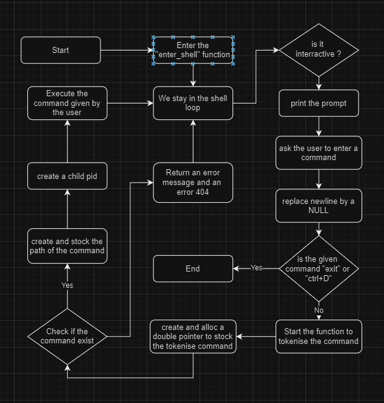

# Simple Shell Project

## Description

My Shell is a simple shell implementation in C, offering basic command-line interface functionality.

## Features

- Displays a prompt "Ardo@Gaetan " and waits for user input
- Executes simple shell commands
- Handles command lines with arguments
- Implements built-in commands: exit, env.
- Handles the PATH to find executable programs
- Supports interactive and non-interactive modes
- Handles the EOF (End Of File) condition

## Requirements

- Ubuntu 20.04 LTS
- GCC compiler with flags: -Wall -Werror -Wextra -pedantic -std=gnu89
- Follow Betty style guidelines
- No more than 5 functions per file
- All header files should be include guarded
- Use system calls only when necessary

## Compilation

To compile the shell, use the following command:

gcc -Wall -Werror -Wextra -pedantic -std=gnu89 *.c -o shell

## Example

Here an exemple of one of the command we can use with our shell

## Flowchart

## Resources

- [Unix shell](https://en.wikipedia.org/wiki/Unix_shell)
- [Thompson shell](https://en.wikipedia.org/wiki/Thompson_shell)
- [Ken Thompson](https://en.wikipedia.org/wiki/Ken_Thompson)

## List of Allowed Functions

access, chdir, close, closedir, execve, exit, _exit, fflush, fork, free, getcwd, getline, getpid, isatty, kill, malloc, open, opendir, perror, printf, fprintf, vfprintf, sprintf, putchar, read, readdir, signal, stat, lstat, fstat, strtok, wait, waitpid, wait3, wait4, write, and all functions from string.h

## Authors
[NaganoMSL228](https://github.com/NaganoMSL228)

[THO-Gaetan](https://github.com/THO-Gaetan)

## License

This project is licensed under the MIT License - see the [LICENSE](LICENSE) file for details.